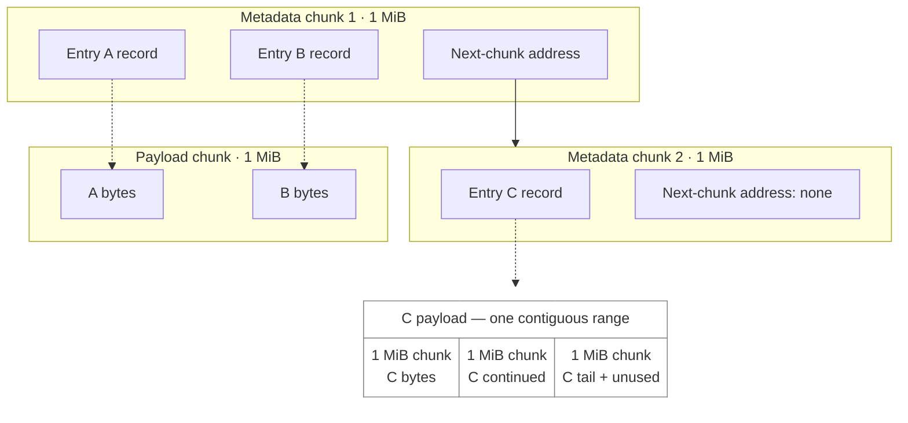

# Disk cache format v13

Experimental, best-effort cache format; no durability or compatibility guarantee.

## Overview

The backing file is divided into 1-MiB chunks of two kinds:

- **Metadata chunks** describe cached entries: their keys, object ranges, payload
  locations, and checksums. Each metadata chunk also links to the next metadata chunk.
- **Payload chunks** hold the cached bytes. Each entry's payload is one contiguous
  byte range, separate from metadata, and may span consecutive chunks.

Example: A and B share a payload chunk; C spans consecutive payload chunks.
Arrows are stored references, not physical disk order.

The solid arrow links metadata chunks. Dashed arrows locate payloads using each
record's address and length. Only three entry records are shown.
On open, the cache follows metadata links to rebuild its in-memory index without
reading payloads. Payload checksums are verified when entries are read.

## Files and encoding

- `data`: backing file; `.feuer.lock`: exclusive directory lock.
- Integers are unsigned little-endian; addresses are absolute byte offsets in `data`.
- No global header or persistent free-space map; ownership is reconstructed on open.

## Metadata chunks

A metadata chunk contains 256 independently checksummed **4-KiB pages**:

| Pages | Contents |
| --- | --- |
| 0–254 | 84 entry records per page: 21,420 records per chunk |
| 255 | Next metadata chunk's address; `u64::MAX` means there is no next chunk |

Metadata chunks remain reserved while open.

### Page layout

Every page begins with this 32-byte header:

| Offset | Bytes | Field |
| --- | --- | --- |
| 0 | 8 | Seed-zero XXHash64 of page bytes `[8, 4096)` |
| 8 | 8 | Reserved; zero |
| 16 | 8 | Slot count: 84 for records, 1 for next-chunk address |
| 24 | 8 | ASCII tag: `FEUDES13` for records, `FEUNXT13` for next-chunk address |

A record page holds 84 consecutive 48-byte records after the header, then 32 zero
bytes. An all-zero record is unused. The next-chunk page holds one `u64` address
after its header, with the rest zero. The address must be chunk-aligned within the
backing file, or `u64::MAX` to end the chain.

### Entry record layout

Offsets are relative to the start of the 48-byte record:

| Offset | Bytes | Field |
| --- | --- | --- |
| 0 | 16 | Object key hash; full key is not stored |
| 16 | 8 | Object range start |
| 24 | 8 | Object range length, greater than zero |
| 32 | 8 | Payload address |
| 40 | 8 | Seed-zero XXHash64 of payload, excluding alignment padding |

## Payload chunks

Payload chunks contain plain bytes, not pages. Payload length equals object range
length; disk storage length is rounded up to 4 KiB. Payload addresses are also
4-KiB-aligned. There are no metadata gaps within a payload.

Small entries may share a chunk within one explicit batch. Entries spanning chunks
start at a chunk boundary and occupy consecutive whole chunks exclusively. Written
chunks are not appended to; individual payload holes are not reused.

## Write ordering and reuse

1. Complete metadata chunk initialization writes before linking to them.
2. Complete payload writes before writing entry records, and metadata writes before
   publishing entries in memory. Metadata updates require read/write synchronization.
3. The allocator releases payload chunks when their last entry is removed. Neither reads
   nor queued writes reserve disk space. Removal does not invalidate the old metadata record.
   Readers validate owned buffers against the expected checksum after I/O; late writes to reused
   payloads can cause checksum misses.

No `fsync` or `fdatasync` is issued. Write completion does not guarantee durability
or persistence ordering after power loss; recovery is best-effort.

## Recovery

Open waits for recovery, which runs on Tokio's blocking pool. Recovery follows metadata links with one 1-MiB read per
metadata chunk; it never scans payload chunks. Zero-filled chunks, read failures,
invalid addresses, cycles, or corrupt links terminate a chain. Corrupt record pages
are discarded independently.

Metadata chunks are reserved before validating entry records and reconstructing payload
occupancy. Range arithmetic, alignment, and file bounds are checked; payloads cannot
claim metadata chunks. Overlapping stale records can share payload reservations.
Duplicate starts and contained ranges are removed while rebuilding the index.
Broken links are repaired by subsequent writes; discarded record pages are rewritten only when reused.
Closing does not invalidate live records.
Stale records may survive reuse; missing or corrupt payloads become cache misses when read,
subject to the usual checksum-collision limitation.
